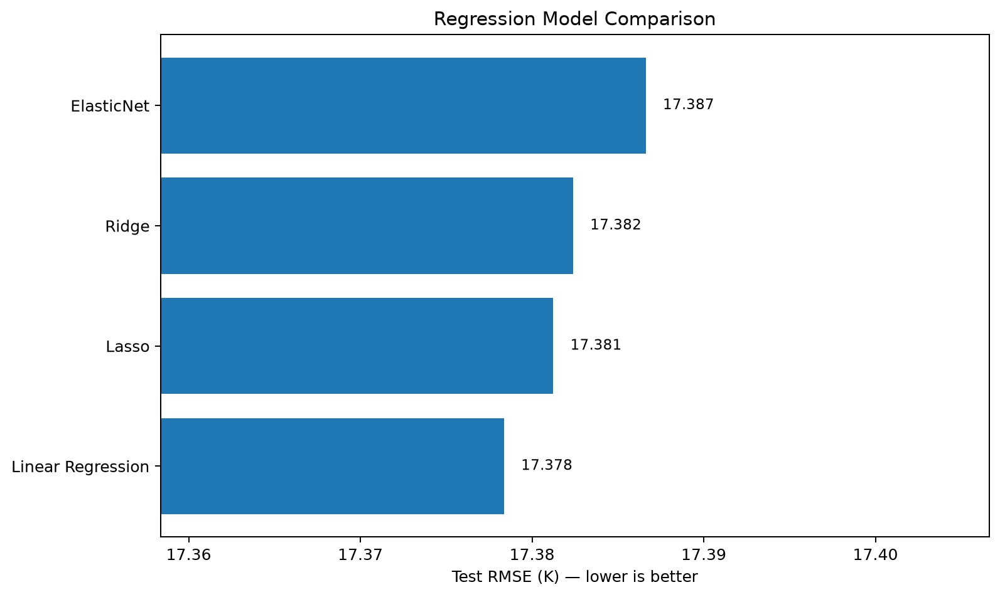
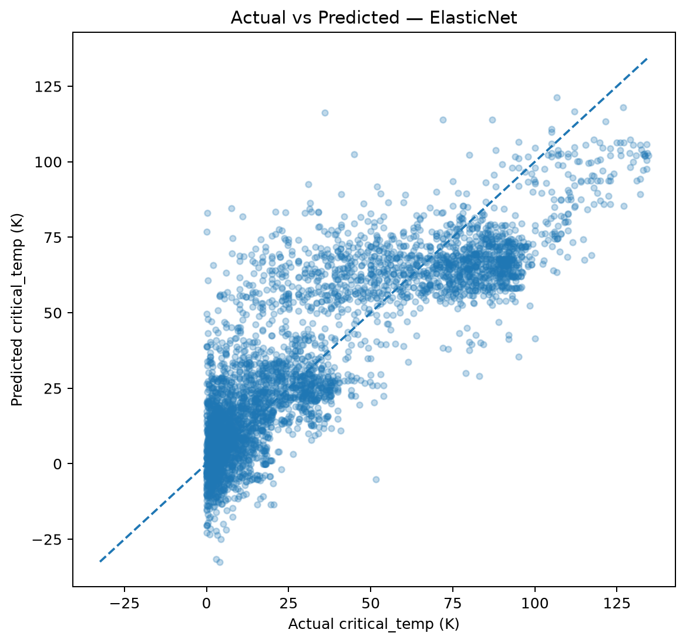
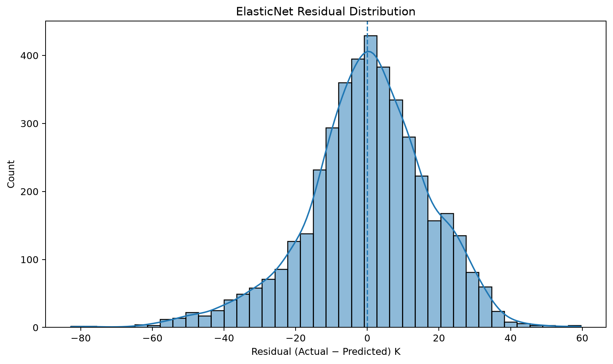

# Superconductivity Critical Temperature Prediction

  <b>ElasticNet • Ridge • Lasso • Linear Regression • FastAPI • Railway</b>

  
  
  
  
  
  

A reproducible machine-learning project for predicting superconducting critical temperature from engineered material properties and elemental composition. The repository combines exploratory analysis, regularized regression, cross-validation, scientific interpretation, automated notebook execution, and a Railway-ready FastAPI service.

---

## Overview

| Item | Details |
|---|---|
| Dataset size | **21,263 materials** |
| Engineered predictors | **81** |
| Target | **`critical_temp`** |
| Models | Linear Regression, Ridge, Lasso, ElasticNet |
| Validation | 5-fold cross-validation + untouched test set |
| Additional experiment | Elemental composition from `unique_m.csv` |
| Analytical coverage | **16/16 questions answered** |
| API | FastAPI |
| Deployment target | Railway |
| License | MIT |

---

## Key Results

| Metric / Finding | Result |
|---|---:|
| Mean critical temperature | **34.42 K** |
| Median critical temperature | **20.00 K** |
| Target skewness | **0.860** |
| IQR extreme values | **1** |
| Strongest positive correlation | `wtd_std_ThermalConductivity` ≈ **+0.721** |
| Strongest negative correlation | `wtd_mean_Valence` ≈ **-0.632** |
| Predictor pairs with `|r| ≥ 0.90` | **74** |
| Weighted means stronger than simple means | **7 / 8** groups |
| Linear Regression RMSE | **17.378 K** |
| Linear Regression R² | **0.738** |
| Ridge best alpha | **0.1** |
| Lasso zero coefficients | **0 / 81** |
| ElasticNet best alpha | **0.0001** |
| ElasticNet best `l1_ratio` | **0.9** |
| ElasticNet CV RMSE | **17.699 ± 0.257 K** |
| ElasticNet CV R² | **0.734 ± 0.006** |
| ElasticNet test RMSE | **17.387 K** |
| ElasticNet test R² | **0.737** |
| Elemental composition RMSE gain | **0.876 K improvement** |
| Elemental composition R² gain | **+0.0258** |

---

## Model Comparison

The project compares four linear and regularized regression approaches under the same train/test split and evaluation framework.

| Model | Interpretation |
|---|---|
| Linear Regression | Best test RMSE among the compared models |
| Ridge Regression | Nearly identical predictive performance; useful for stabilizing coefficients under multicollinearity |
| Lasso Regression | Cross-validation selected very weak regularization; no coefficients were reduced exactly to zero |
| ElasticNet Regression | Stable mixed L1/L2 regularization with interpretable coefficients |

> **Important:** the project reports the measured result rather than forcing ElasticNet to appear superior. Linear Regression achieved the lowest test RMSE in the comparison.

  

---

## Final ElasticNet Performance

| Metric | Value |
|---|---:|
| MAE | **13.210 K** |
| MSE | **302.295** |
| RMSE | **17.387 K** |
| R² | **0.737** |
| Residual mean | **-0.160 K** |
| Residual SD | **17.386 K** |

### 5-Fold Cross-Validation

| Metric | Mean ± SD |
|---|---:|
| RMSE | **17.699 ± 0.257 K** |
| R² | **0.734 ± 0.006** |

The low fold-to-fold variation indicates reasonably stable performance across validation folds.

### Actual vs Predicted

  

### Residual Distribution

  

---

## Feature Interpretation

The strongest linear relationships with critical temperature include:

- **Positive:** `wtd_std_ThermalConductivity` at approximately **+0.721**
- **Negative:** `wtd_mean_Valence` at approximately **-0.632**

The dataset also contains **74 predictor pairs with |r| ≥ 0.90**, indicating substantial multicollinearity. This is a key reason for comparing Ridge, Lasso, and ElasticNet with ordinary Linear Regression.

Weighted property means show stronger absolute correlation than their unweighted equivalents in **7 of 8** matched property groups, suggesting that composition-aware weighting preserves useful predictive information.

> Correlation and coefficient magnitude are interpreted as model associations, not causal physical laws.

---

## Elemental Composition Experiment

Question 15 tests whether adding elemental-composition variables from `unique_m.csv` improves prediction beyond the engineered features in `train.csv`.

The result is positive:

- **RMSE improves by 0.876 K**
- **R² improves by +0.0258**

This indicates that raw elemental composition contributes predictive signal that is not fully represented by the engineered feature set.

---

## Scientific / R&D Interpretation

The highest-magnitude standardized ElasticNet coefficients include:

- `wtd_gmean_atomic_radius`
- `wtd_mean_atomic_radius`
- `entropy_fie`
- `wtd_mean_atomic_mass`
- `std_ElectronAffinity`
- `wtd_mean_FusionHeat`
- `entropy_Valence`
- `wtd_gmean_Valence`

A practical materials-screening workflow could use the model to:

1. generate or collect candidate materials,
2. compute the required engineered features,
3. predict critical temperature,
4. rank candidates by predicted potential,
5. apply scientific and manufacturing constraints,
6. prioritize promising candidates for laboratory validation,
7. incorporate new experimental outcomes into future model versions.

The model is intended as **decision support**, not as proof of causation or a replacement for experimental validation.

---

## FastAPI Service

The repository includes a Railway-ready FastAPI application in `app.py`.

### API Endpoints

| Endpoint | Method | Purpose |
|---|---|---|
| `/` | GET | Project/API landing page |
| `/docs` | GET | Interactive Swagger documentation |
| `/health` | GET | Service health check |
| `/model-info` | GET | Model configuration and validated metrics |
| `/features` | GET | Expected feature names |
| `/sample` | GET | Ready-to-use example prediction payload |
| `/predict` | POST | Predict superconducting critical temperature |

### Deployment Behavior

At startup, the API:

1. loads `data/raw/train.csv`,
2. detects all 81 model features,
3. creates a `StandardScaler + ElasticNet` pipeline,
4. refits the model on the full available dataset using:
   - `alpha = 0.0001`
   - `l1_ratio = 0.9`
5. exposes the fitted model through the REST API.

The API-reported validation metrics remain the held-out results from the notebook analysis.

---

## Deploy on Railway

This repository already includes:

- `Procfile`
- `railway.json`
- FastAPI runtime dependencies in `requirements.txt`
- `/health` endpoint for Railway health checks

### Deployment Steps

1. Create a new Railway project.
2. Choose **Deploy from GitHub Repo**.
3. Select this repository.
4. Railway will install dependencies automatically.
5. The service starts with:

~~~bash
uvicorn app:app --host 0.0.0.0 --port $PORT
~~~

6. Generate a public Railway domain.
7. Open the deployed root URL.

Once deployed:

~~~text
https://YOUR-RAILWAY-DOMAIN/
https://YOUR-RAILWAY-DOMAIN/docs
https://YOUR-RAILWAY-DOMAIN/health
~~~

### Test a Prediction

Open:

~~~text
GET /sample
~~~

Copy the returned payload and send it to:

~~~text
POST /predict
~~~

Example response:

~~~json
{
  "predicted_critical_temp_k": 42.7315,
  "model": "ElasticNet Regression",
  "feature_count": 81
}
~~~

---

## Analytical Coverage

The notebook answers all 16 structured project questions and includes an explicit conclusion after each section.

| # | Analysis Area | Status |
|---:|---|:---:|
| 1 | Target distribution, skewness, extreme values | Complete |
| 2 | Strongest positive and negative relationships | Complete |
| 3 | Multicollinearity | Complete |
| 4 | Weighted vs unweighted features | Complete |
| 5 | Number of elements vs critical temperature | Complete |
| 6 | Physical-property importance | Complete |
| 7 | Linear Regression baseline | Complete |
| 8 | Ridge vs Linear Regression | Complete |
| 9 | Lasso feature shrinkage | Complete |
| 10 | ElasticNet vs other models | Complete |
| 11 | Best `alpha` and `l1_ratio` | Complete |
| 12 | 5-fold CV stability | Complete |
| 13 | Positive / negative ElasticNet coefficients | Complete |
| 14 | Test metrics + residual analysis | Complete |
| 15 | Elemental-composition experiment | Complete |
| 16 | Scientific / R&D interpretation | Complete |

- [View all 16 questions](docs/16_questions.md)
- [Read the detailed results and interpretation](docs/RESULTS_AND_INTERPRETATION.md)

---

## Project Structure

~~~text
superconductivity-elasticnet-regression/
├── .github/
│   └── workflows/
├── data/
│   └── raw/
│       ├── train.csv
│       └── unique_m.csv
├── docs/
│   ├── 16_questions.md
│   └── RESULTS_AND_INTERPRETATION.md
├── notebooks/
│   └── Superconductivity_ElasticNet_16_Questions.ipynb
├── outputs/
│   ├── figures/
│   ├── models/
│   └── reports/
│       └── final_summary.json
├── scripts/
│   └── generate_readme_figures.py
├── src/
│   ├── data_loader.py
│   ├── evaluation.py
│   └── modeling.py
├── app.py
├── config.py
├── Procfile
├── railway.json
├── requirements.txt
├── run_analysis.py
├── LICENSE
└── README.md
~~~

---

## Local Setup

### Clone

~~~bash
git clone https://github.com/mightyalok00/superconductivity-elasticnet-regression.git
cd superconductivity-elasticnet-regression
~~~

### Create a virtual environment

~~~bash
python -m venv .venv
~~~

**Windows**

~~~bash
.venv\Scripts\activate
~~~

**macOS / Linux**

~~~bash
source .venv/bin/activate
~~~

### Install dependencies

~~~bash
pip install -r requirements.txt
~~~

### Run the API locally

~~~bash
uvicorn app:app --reload
~~~

Open:

~~~text
http://127.0.0.1:8000
http://127.0.0.1:8000/docs
~~~

### Run the notebook

Open:

~~~text
notebooks/Superconductivity_ElasticNet_16_Questions.ipynb
~~~

Or run:

~~~bash
python run_analysis.py
~~~

---

## Reproducibility

The repository includes GitHub Actions workflows for:

- executing the analysis notebook,
- regenerating README figures,
- committing generated analysis artifacts.

The modeling workflow uses:

- fixed random state,
- consistent train/test splitting,
- scaling inside scikit-learn pipelines,
- GridSearchCV,
- 5-fold cross-validation,
- untouched final test evaluation.

---

## Technology Stack

- Python 3.12
- Pandas
- NumPy
- Matplotlib
- Seaborn
- scikit-learn
- Jupyter Notebook
- FastAPI
- Uvicorn
- GitHub Actions
- Railway

---

## Limitations

- Correlation does not establish causation.
- Linear models may miss nonlinear interactions between material properties.
- Highly correlated predictors complicate coefficient-level interpretation.
- Some higher element-count groups contain relatively few observations.
- Dataset performance does not guarantee performance on unseen material families.
- Real scientific use requires independent data and laboratory validation.

---

## Future Work

- add nonlinear baselines such as Random Forest or Gradient Boosting,
- add SHAP or permutation-based explanation workflows,
- add automated API and model tests,
- add model artifact versioning,
- evaluate the model on independent superconductivity data,
- compare deployment-time inference against the notebook baseline.

---

## Author

**Alok Agarwal**

SEO & Digital Marketing professional transitioning into **Data Science, AI and Machine Learning**, with a focus on practical analytics, reproducible ML workflows, model interpretation, and deployable applications.

[GitHub Profile](https://github.com/mightyalok00)

---

## License

The source code and project documentation are released under the [MIT License](LICENSE).

The included UCI Superconductivity dataset is third-party data and is not relicensed by this repository. Dataset reuse should follow the terms and attribution requirements of its original source.
